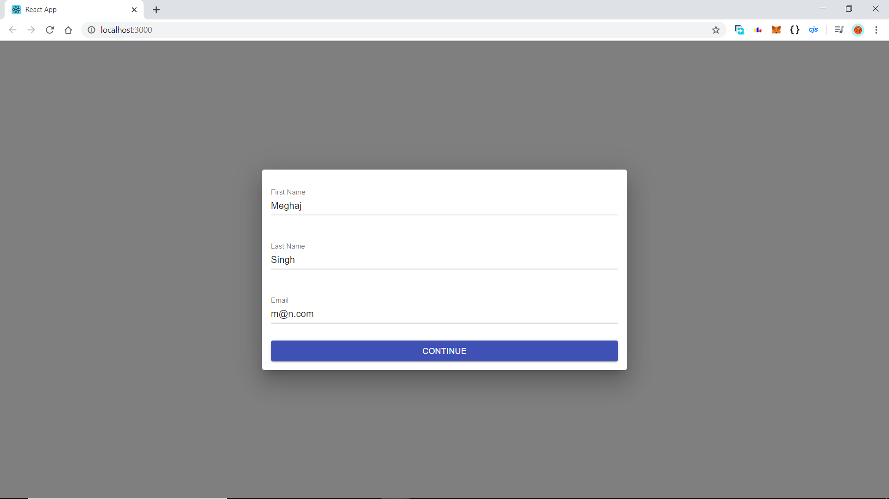
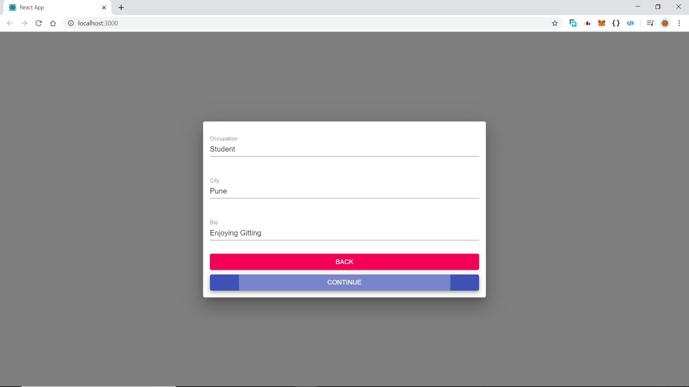
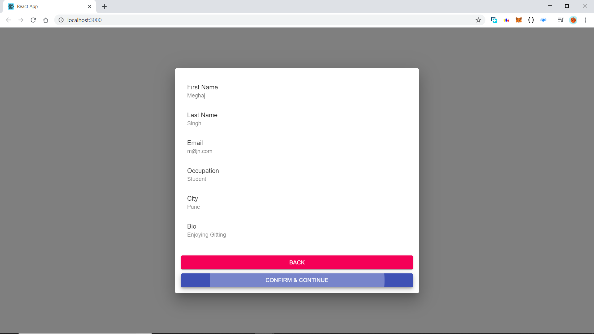
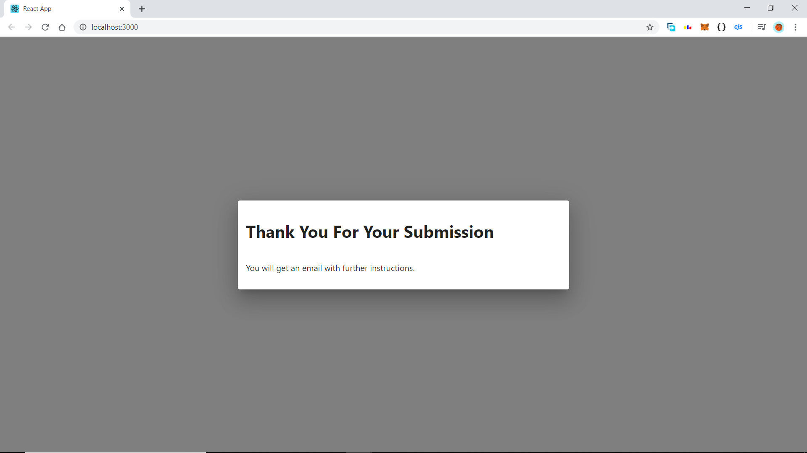

# ReactJS Step-By-Step Form

This is a simple ReactJS based Step-by-Step form that uses the following functionalities/modules:-

1. `ReactJS`.

2. `NodeJS`.

3. `Material_UI`.

Various components were created to help make this step-by-step form :-

1. First Step includes the filling up of Name and e-mail id.

2. Second step includes the filling up of occupation, city and bio.

3. Third Step is the final one and includes the confirmation of the         filled-up details

4. Fourth step displays the "Thank You!" Message and the form is filled up!

